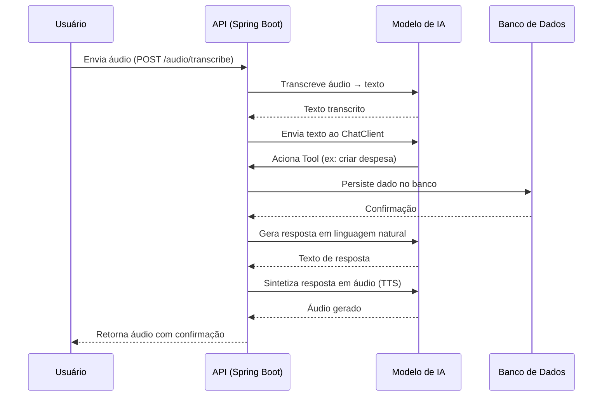

---

# 🤖 Smart Budget API — IA Generativa com Spring Boot & Spring AI

> Projeto desenvolvido durante o **Bootcamp Santander + DIO**, explorando a integração de **Inteligência Artificial Generativa** em uma aplicação Java de orçamento financeiro com arquitetura profissional.

---

## 📌 Sobre o Projeto

A **Smart Budget API** é uma aplicação backend inteligente que combina o poder do **Spring Boot** com **Spring AI** para criar uma experiência conversacional por voz em um contexto de gestão financeira.

A aplicação é capaz de:
- 🎙️ **Interpretar comandos de voz** do usuário
- 🗣️ **Transcrever áudio em texto** (Speech-to-Text)
- ⚙️ **Acionar funções reais da aplicação** via Tool Calling com IA
- 🔊 **Gerar respostas em áudio** (Text-to-Speech)
- 💾 **Persistir dados** de orçamento financeiro
- 🌐 **Expor endpoints REST** bem estruturados

---

## 🏗️ Arquitetura

```
src/
└── main/
    └── java/
        └── com.example.smartbudget/
            ├── application/
            │   ├── input/                      # Portas de entrada (casos de uso)
            │   ├── output/                     # Portas de saída
            │   └── PersistTransactionUseCase.java
            ├── domain/
            │   ├── Category.java               # Enum/Entidade de categoria
            │   ├── Transaction.java            # Entidade principal de transação
            │   ├── TransactionId.java          # Value Object de identidade
            │   └── TransactionRepository.java  # Contrato do repositório
            ├── ChatClientController.java        # Endpoint do ChatClient (Spring AI)
            ├── ChatModelController.java         # Endpoint do modelo de chat
            ├── TextToSpeechController.java      # Endpoint TTS (voz → áudio)
            ├── TranscriptionController.java     # Endpoint STT (áudio → texto)
            └── Application.java                # Entry point Spring Boot
```

> Arquitetura inspirada em **Ports & Adapters (Hexagonal)**, com separação clara entre domínio, casos de uso e controllers — padrão amplamente adotado em sistemas financeiros enterprise.

---

## 🧠 Conceitos Aplicados

| Conceito | Descrição |
|---|---|
| **ChatClient (Spring AI)** | Cliente configurado para comunicação com modelos de IA generativa |
| **Tool Calling** | Permite que a IA acione funções reais da aplicação com base no contexto |
| **Speech-to-Text** | Transcrição de áudio enviado pelo usuário em texto processável |
| **Text-to-Speech** | Síntese de voz para retornar respostas faladas ao usuário |
| **Spring Data JPA** | Persistência dos dados de orçamento financeiro |
| **REST API** | Exposição de endpoints seguindo boas práticas RESTful |

---

## 🛠️ Stack Tecnológica

- **Java 17+**
- **Spring Boot 3.x**
- **Spring AI**
- **Spring Data JPA / Hibernate**
- **PostgreSQL** (ou H2 para ambiente local)
- **Docker / Docker Compose**
- **Maven**

---

## 🚀 Como Executar

### 1. Clone o repositório

```bash
git clone https://github.com/lucascaldardo/api-inteligente-modelo-de-fala.git
cd api-inteligente-modelo-de-fala
```

### 2. Configure as variáveis de ambiente

```properties
spring.ai.openai.api-key=SUA_CHAVE_AQUI
spring.datasource.url=jdbc:postgresql://localhost:5432/smartbudget
spring.datasource.username=seu_usuario
spring.datasource.password=sua_senha
```

### 3. Suba o banco com Docker

```bash
docker compose up -d
```

### 4. Rode a aplicação

```bash
./mvnw spring-boot:run
```

---

## 📡 Endpoints Principais

| Método | Endpoint | Descrição |
|--------|----------|-----------|
| `POST` | `/api/audio/transcribe` | Envia áudio → recebe texto transcrito |
| `POST` | `/api/chat` | Envia mensagem → resposta da IA |
| `POST` | `/api/audio/speak` | Texto → áudio sintetizado (TTS) |
| `GET` | `/api/budget` | Lista itens do orçamento |
| `POST` | `/api/budget` | Cria novo item |
| `PUT` | `/api/budget/{id}` | Atualiza item |
| `DELETE` | `/api/budget/{id}` | Remove item |

---

## 💡 Fluxo da Conversa com IA



---

## 🎯 Destaques Técnicos

- ✅ **Tool Calling real** — a IA não apenas conversa, ela **executa ações** na aplicação
- ✅ **Pipeline completo de voz** — áudio → texto → processamento → texto → áudio
- ✅ **Arquitetura Hexagonal** — separação clara entre domínio, casos de uso e controllers
- ✅ **Pronto para evolução** — base sólida para autenticação, multi-usuário, relatórios
- ✅ **Domínio financeiro** — contexto alinhado ao setor bancário e fintechs

---

## 🏆 Bootcamp

Projeto desenvolvido no **Bootcamp Santander + DIO**

<div align="center"><sub>Feito com ☕ Java, 🍃 Spring e 🤖 IA Generativa</sub></div>
```
